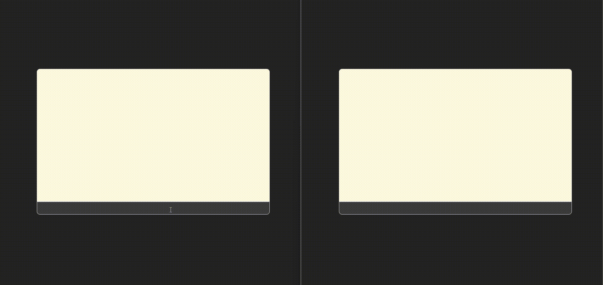

# `Real-Time Chat App`
**Patika.dev** React Course Real Time Chat Application
> The frontend side of the project was created with React.js was bootstrapped with [Vite + React + TypeScript](https://vitejs.dev)

> The backend side of the project was created with Node.js was bootstrapped with [Express](https://expressjs.com)

## `Used Technologies`
### **Frontend**
> **HTML** - **CSS** - **JavaScript** - **TypeScript**  - **ReactJS**

### **Backend**
> **NodeJS** - **Express**

## `Used Libraries`
### **Frontend**
- react
- react-dom
- react-scrollable-feed
- socket.io-client
- @types/node
### **Backend**
- express
- cors
- lodash
- redis
- shortid
- socket.io


## `Run Application`
- Create an `.env` file in the backend directory before starting the application
- Edit according to the contents of the `.env.local` file
- Customize the **Redis** database configuration in the backend according to your needs

Run in **Backend** and **Frontend** directory :
````shell
npm install
````
````shell
npm run dev
````
Runs backend and frontend app in the development mode
* Frontend -> Open [http://localhost:5173](http://localhost:5173) to view it in the browser.
* Backend -> Open [http://localhost:3000](http://localhost:3000) to view it in the browser.

## `Preview`
